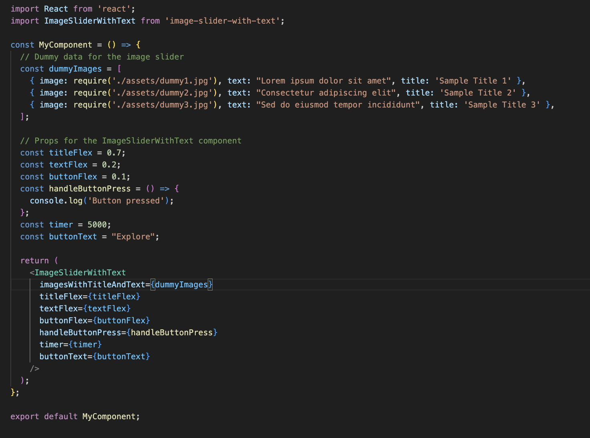

# React Native Carousel with autoplay

react-native-carousel-autoplay

The react-native-carousel-autoplay component is a versatile and customizable React component that allows you to create an image slider with associated text and a customizable button. This component is designed to enhance your user interface by presenting a visually appealing slideshow with text and an interactive button.

# Props

imagesWithTitleAndText: An array of objects, each containing an image, text, and title.

titleFlex: A number representing the flex value for the title section of each slide.

textFlex: A number representing the flex value for the text section of each slide.

buttonFlex: A number representing the flex value for the button section of each slide.

handleButtonPress: A function to be executed when the button is pressed.

timer: The time interval (in milliseconds) between automatic slide transitions.

buttonText: The text to be displayed on the button.

# Example Usage

# reac-native-carousel-component
